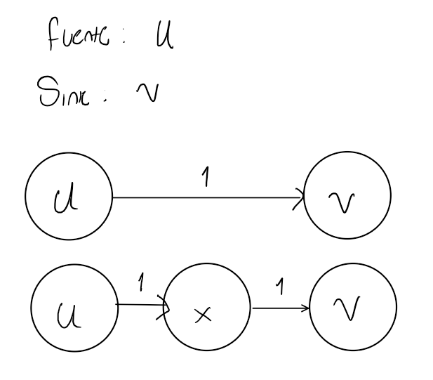

# Analisys questions 

## 1. Explique cual es la complejidad temporal de los algoritmos vistos en clase: BFS, Dijkstra(Priority Queue), Bellman-Ford, kruskal y Floyd-Warshall.

- BFS: Para este algorimo la complejidad es de $O(V+E)$, esto es porque BFS recorre todos los vertices y arcos del grafo.

- Dijkstra(Priority Queue): Para este algorimo la complejidad es de $O((V+E)logV)$, esto es porque por cada vertice se recorren todos sus adyacentes y dentro de este recorrido de haces operaciones de pop y push en una cola de prioridad lo que toma un tiempo de $O(logV)$.

- Bellman-Ford: Para este algorimo la complejidad es de $O(VE)$, estos es porque cada arco se recorre $V-1$ veces ya que para cualquier nodo el camino más corto tendrá en el peor de los casos $V-1$ arcos.

- Kruskal: Para este algorimo la complejidad es de $O(ElogE)$, esto es porque cada arco se recorre una vez, los arcos están contenidos en una priority queue y extraer siempre el arco mínimo toma una complejidad de $logE$.

- Floyd-Warshall: Para este algorimo la complejidad es de $O(V^3)$, estos es porque hay 3 fors anidados que recorren todos los arcos.

## 2. Explique por que el algoritmo de Dijkstra no funciona en un grafo que tiene arcos negativos, de ser necesario puede usar un ejemplo para ilustrar su explicación.

No funciona por su enfoque greedy y porque Dijkstra aplica relajamiento a todos los arcos solo por una vez ya que espera que despues del primera relajamiento ya se tenga la distance más corta al nodo final de ese arco, por lo que al tener pesos negativos con solo un relajamiento por arco no es seguro llega a la distancia minima. Por ejemplo:

Se parte desde $A$, se marca como visitado y las distances minimas a $B$ y $C$ quedan como 5 y 6 respectivamente, se pasa a $B$ por ser el arco minimo pero no tiene adyacentes así que se marca como visitado y se pasa a $C$ en donde hay un arco que puede dar una distancia menor de $A$ a $C$, pero no sigue ese camino porque B ya se marcó anteriormente como visidado.

## 3. Un grafo bipartito, es un grafo tal que el conjunto de nodos se puede expresar como dos conjuntos disjuntos, de manera que no hay dos nodos del mismo conjunto que sean adyacentes. Diseñe un algoritmo que reciba un grafo, en su implantación indique si su grafo esta implementado como lista o matriz de adyacencia, y retorne $True$ si el grafo es bipartito y $False$ en otro caso. La complejidad no debe superar $O(VE)$, donde V es el conjunto de nodos y E el conjunto de arcos del grafo.

Algoritmo en is_bipartite.py. Recibe una lista de adyacencia.

## 4. Un grafo ponderado desconectado no tiene árboles de expansión. Sin embargo, es posible encontrar un bosque de expansión de peso mínimo en un grafo de este tipo. Explique cómo modificar tanto el algoritmo de Kruskal como el algoritmo de Prim para hacer esto.

En los dos algoritmos es necario primero identificar los componentes del grafo desconecato. Tanto para Kruskal como Prim, seguirá funcionando de la misma manera siempre y cuando su condicion de terminacion sea haber recorrido todos los $V$ arcos y no de que la  cantidad de arcos agregados al MST sea $V-1$, ya que en un grafo no conectado esto no siempre será posible. Como el algoritmo siempre escogera el arco minimo, se escogerán independientemente del componente al que pertenezcan, si se quiere mantener el registro de cual es el MST para cada componente, basta con verificar a cual componente pertenecen los nodos implicados en el arco seleccionado y desde ahí realizar las otras validaciones correspondientes como que no se formen ciclo y lo demás propio de cada algoritmo para cada componente.

## 5. Explique porque el flujo máximo se alcanza cuando la red residual no contiene caminos de aumento.

Por la misma definición de lo que es un camino de aumento, es decir, una camino que aún tiene capacidad disponible desde la fuente hasta el sink por lo que en caso de que ya no sea posible llevar más material hasta el sink, es porque ya no hay más caminos de aumento y vicebersa.

## 6.  Suponga que la red de flujo G contiene la arista (u,v) se crea un nueva red de flujo G’ creando un nuevo vértice x y sustituyendo (u,v) por nuevas aristas (u,x) y (x,v) tal que c(u,x)= (x,v)=c(u,v). Demuestre que un flujo m´aximo en G’ tiene el mismo valor que un flujo máximo en G.

El cambio se representa por la siguiente imagen.

Como es notable en este ejemplo, el flujo total de la red no cambia porque no cambia el flujo desde el nodo $u$ hasta el $v$. Esto es posible gracias a la definición de lo que es un red de flujo que implica que de cualquier nodo debe salir la misma cantidad de material de la que entra y siempre y cuando del nuevo nada dirija su contenido solo al nodo destino original de la arista, el bottleneck seguirá siendo el mismo entre esa par de nodos y por lo tanto no se encontrará un nuevo camino de aumento y por lo tanto el flujo máximo no cambiará.